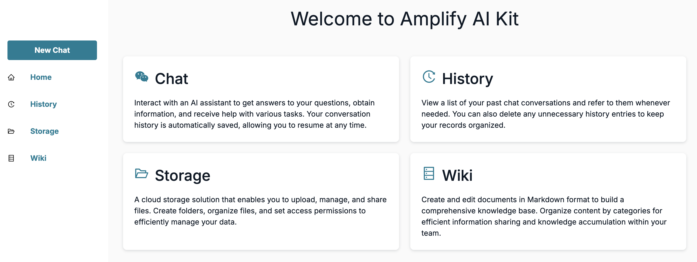

# Amplify Gen2 Next.js クイックスタート



このプロジェクトは [AWS Amplify Gen2](https://docs.amplify.aws/gen2/) と [Next.js](https://nextjs.org/) を組み合わせたクイックスタートテンプレートです。Amplify Gen2のTypeScriptベースのインフラストラクチャ定義と、Next.jsのフロントエンドフレームワークを使用して、フルスタックアプリケーションを素早く構築できます。

## 機能

このクイックスタートには以下の機能が含まれています：

- **認証** - Amplify Authを使用したユーザー認証
- **データモデル** - Amplify Dataを使用したデータモデリングとAPI
- **チャット** - AIアシスタントとの対話と会話履歴
- **履歴** - 過去のチャット会話の表示と管理
- **ストレージ** - ファイルのアップロードと管理のためのクラウドストレージ
- **Wiki** - Markdownフォーマットでのドキュメント作成・編集

## 前提条件

- [Node.js](https://nodejs.org/) (v20以上)
- [AWS アカウント](https://aws.amazon.com/)
- [AWS CLI](https://aws.amazon.com/cli/) (設定済み)

## セットアップ

1. 依存関係をインストールします：

```bash
npm install
```

2. Amplify Gen2のバックエンドをローカルで実行します：

```bash
npx ampx sandbox
```

3. 別のターミナルでNext.jsの開発サーバーを起動します：

```bash
npm run dev
```

4. ブラウザで [http://localhost:3000](http://localhost:3000) を開いてアプリケーションを確認します。

## プロジェクト構造

```
/
├── app/                  # Next.jsアプリケーションコード
│   ├── _components/      # 共有コンポーネント
│   ├── chat/             # チャット機能
│   ├── history/          # チャット履歴機能
│   ├── storage/          # ストレージ機能
│   ├── wiki/             # Wiki機能
│   ├── layout.tsx        # ルートレイアウト
│   └── page.tsx          # メインページ
├── amplify/              # Amplify Gen2のバックエンド定義
│   ├── auth/             # 認証リソース
│   ├── data/             # データモデルリソース
│   ├── storage/          # ストレージリソース
│   └── backend.ts        # バックエンド定義
├── docs/                 # ドキュメント
│   └── image/            # ドキュメント画像
├── public/               # 静的アセット
└── ...
```

## 学習リソース

- [Amplify Gen2 ドキュメント](https://docs.amplify.aws/gen2/)
- [Next.js ドキュメント](https://nextjs.org/docs)
- [Amplify UI コンポーネント](https://ui.docs.amplify.aws/)

## ローカル開発

```bash
# 開発サーバーの起動
npm run dev

# コードのフォーマット
npm run format

# 型チェック
npm run tsc
```

## ライセンス

このプロジェクトは [MIT ライセンス](../LICENSE) の下で公開されています。
